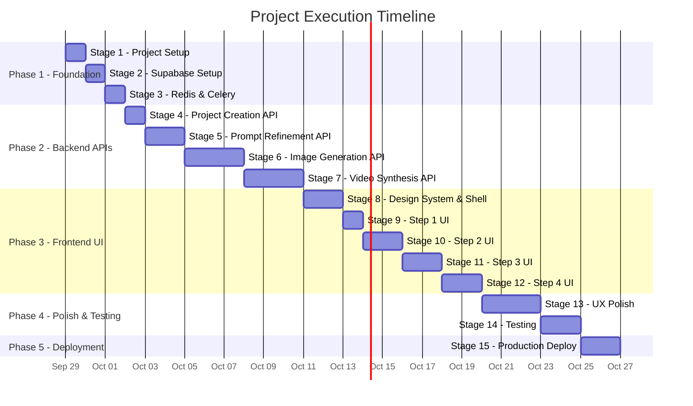

# Execution Plan: Interactive AI Video Generation Pipeline
**From Zero to Production**

---

## Overview

The project is divided into **5 Phases** across **15 Stages**. Each phase builds on the previous one, ensuring we always have a working, testable system at every checkpoint.

**Estimated Timeline:** 6–8 weeks (solo developer, full-time)

---

## Phase 1: Foundation & Scaffolding
*Goal: Get the project structure, tooling, and dev environment fully operational before writing any feature code.*

### Stage 1 — Project Initialization & Monorepo Setup
**Duration:** 1 day

| # | Task | Details |
|---|---|---|
| 1.1 | Initialize Git repo | ✅ Already done |
| 1.2 | Create monorepo structure | Two top-level directories: `frontend/` (Next.js) and `backend/` (FastAPI) |
| 1.3 | Scaffold Next.js app | `npx create-next-app@latest ./frontend` with TypeScript, App Router, Tailwind CSS |
| 1.4 | Scaffold FastAPI backend | Create `backend/` with `main.py`, `requirements.txt`, virtual env setup |
| 1.5 | Add shared config files | Root `.gitignore`, `.env.example`, `README.md` |
| 1.6 | Setup linting & formatting | ESLint + Prettier (frontend), Ruff + Black (backend) |

**Deliverable:** Running `npm run dev` serves the Next.js app; running `uvicorn` serves FastAPI. Both return a health check.

```
vdo-pipeline/
├── frontend/           # Next.js 14+ (TypeScript)
│   ├── src/
│   │   ├── app/        # App Router pages
│   │   ├── components/ # Reusable UI components
│   │   ├── hooks/      # Custom hooks (polling, state)
│   │   ├── lib/        # API client, utilities
│   │   └── types/      # TypeScript interfaces
│   └── package.json
├── backend/            # FastAPI (Python)
│   ├── app/
│   │   ├── api/        # Route handlers
│   │   ├── core/       # Config, settings, security
│   │   ├── models/     # Pydantic models & DB schemas
│   │   ├── services/   # Business logic (AI API callers)
│   │   ├── workers/    # Celery task definitions
│   │   └── main.py     # FastAPI app entry point
│   ├── requirements.txt
│   └── Dockerfile
├── documetation/       # PRD, Tech Docs, This Plan
├── .env.example
├── .gitignore
└── README.md
```

---

### Stage 2 — Database & Storage Setup (Supabase)
**Duration:** 1 day

| # | Task | Details |
|---|---|---|
| 2.1 | Create Supabase project | Set up on [supabase.com](https://supabase.com) |
| 2.2 | Create `projects` table | Schema as defined in `technical_architecture.md` |
| 2.3 | Create `pipeline_status` ENUM | `DRAFT`, `PROMPT_REFINED`, `GENERATING_IMAGES`, `IMAGES_READY`, `GENERATING_VIDEO`, `VIDEO_READY`, `FAILED` |
| 2.4 | Set up Supabase Storage bucket | Create `media` bucket for generated images and videos |
| 2.5 | Enable Row Level Security (RLS) | Basic policies for session isolation |
| 2.6 | Test DB connection from FastAPI | Write a simple `/api/v1/health/db` endpoint that queries Supabase |

**Deliverable:** FastAPI can read/write to Supabase. Storage bucket accepts file uploads.

---

### Stage 3 — Redis & Celery Worker Setup
**Duration:** 1 day

| # | Task | Details |
|---|---|---|
| 3.1 | Set up Redis | Local via Docker (`docker run redis`) or cloud (Upstash/Render Redis) |
| 3.2 | Configure Celery | `celery_app.py` with Redis as broker and result backend |
| 3.3 | Create a test task | Simple Celery task that sleeps 5s and updates a DB row |
| 3.4 | Verify async flow | FastAPI enqueues task → Celery picks it up → DB status updates |
| 3.5 | Add task status tracking | Worker updates `projects.status` and `projects.task_id` on start/complete/fail |

**Deliverable:** Full async pipeline proven — FastAPI enqueues, Celery executes, DB reflects state changes.

---

## Phase 2: Core Pipeline (Backend API + AI Integrations)
*Goal: Build every backend endpoint and integrate all external AI APIs. Frontend is not needed yet — test everything with Postman/curl.*

### Stage 4 — Step 1 API: Project Creation
**Duration:** 0.5 day

| # | Task | Details |
|---|---|---|
| 4.1 | `POST /api/v1/projects` | Accepts `raw_prompt` and `style_tags`, creates DB row with `DRAFT` status |
| 4.2 | `GET /api/v1/projects/{id}` | Returns full project state (used by frontend for polling) |
| 4.3 | Input validation | Pydantic models for request/response schemas |

**Deliverable:** Can create and retrieve a project via API.

---

### Stage 5 — Step 2 API: Prompt Refinement (Gemini)
**Duration:** 1–2 days

| # | Task | Details |
|---|---|---|
| 5.1 | Integrate Gemini SDK | `google-genai` Python package, configure with `GEMINI_API_KEY` |
| 5.2 | Design system prompt | Craft the prompt engineering template that expands raw ideas into detailed production prompts |
| 5.3 | `POST /api/v1/projects/{id}/refine-prompt` | Sends raw prompt + styles to Gemini, returns refined text |
| 5.4 | Save refined prompt to DB | Update `projects.refined_prompt`, set status to `PROMPT_REFINED` |
| 5.5 | Add regeneration support | Alternate system instructions for variety on re-trigger |
| 5.6 | Error handling | Timeout, rate limit, and API failure handling with retries |

**Deliverable:** Send "cyberpunk alley" → get back a rich 200-word production prompt with camera angles, lighting, textures.

---

### Stage 6 — Step 3 API: Image Generation
**Duration:** 2–3 days

| # | Task | Details |
|---|---|---|
| 6.1 | Build service layer abstraction | `ImageGenerationService` with a common interface for all providers |
| 6.2 | Integrate Gemini Image | Gemini API image generation endpoint |
| 6.3 | Integrate Google Flow | Google Flow API integration |
| 6.4 | Integrate Nano Banana Pro / 2 | Nano Banana API integration |
| 6.5 | Integrate Freepik Magnific | Freepik image API integration |
| 6.6 | Create Celery image task | Worker calls selected provider, downloads images, uploads to Supabase Storage |
| 6.7 | `POST /api/v1/projects/{id}/generate-images` | Accepts `model` choice, enqueues task, returns `202` |
| 6.8 | Update DB on completion | Store image URLs array in `projects.image_urls`, status → `IMAGES_READY` |

> [!IMPORTANT]
> Build each provider integration behind a **common interface** so the frontend just passes a `model` string and the backend routes to the correct API. This keeps the system extensible.

```python
# Example service abstraction
class ImageProvider(ABC):
    @abstractmethod
    async def generate(self, prompt: str, count: int) -> list[str]:
        """Returns list of image URLs"""
        pass

class GeminiImageProvider(ImageProvider): ...
class GoogleFlowProvider(ImageProvider): ...
class NanaBananaProvider(ImageProvider): ...
class FreepikMagnificProvider(ImageProvider): ...
```

**Deliverable:** API call with any model choice → 2-4 images stored in Supabase → URLs returned.

---

### Stage 7 — Step 4 API: Video Synthesis
**Duration:** 2–3 days

| # | Task | Details |
|---|---|---|
| 7.1 | Build video service abstraction | `VideoGenerationService` with common interface |
| 7.2 | Integrate Kling 2.5 | Kling API integration (image-to-video at 720p) |
| 7.3 | Integrate Minimax Hailuo Fast 2.3 | Minimax API integration |
| 7.4 | Integrate Gemini Video | Gemini video generation endpoint |
| 7.5 | Integrate Freepik Video | Freepik video API integration |
| 7.6 | Create Celery video task | Worker calls provider, polls for completion, downloads MP4, uploads to Supabase |
| 7.7 | `POST /api/v1/projects/{id}/synthesize-video` | Accepts `model`, `image_url`, enqueues task, returns `202` |
| 7.8 | Handle long-running jobs | Internal polling/webhook pattern for APIs that take 30-120s |
| 7.9 | Update DB on completion | Store video URL, status → `VIDEO_READY` |

**Deliverable:** Full backend pipeline works end-to-end: Text → Refined Prompt → Images → Video. All via curl/Postman.

---

## Phase 3: Frontend (Next.js Wizard UI)
*Goal: Build the complete 4-step wizard interface that consumes all backend APIs.*

### Stage 8 — Design System & Layout Shell
**Duration:** 1–2 days

| # | Task | Details |
|---|---|---|
| 8.1 | Setup global styles | Color palette, typography (Inter/Outfit from Google Fonts), dark mode tokens |
| 8.2 | Build layout shell | App layout with header, stepper progress bar, content area |
| 8.3 | Build `Stepper` component | Visual step indicator (Step 1 → 2 → 3 → 4) with active/completed states |
| 8.4 | Build shared UI components | Button, Card, TextArea, LoadingSpinner, SkeletonScreen, ErrorBanner |
| 8.5 | Setup API client | Axios/fetch wrapper pointing to FastAPI backend with error interceptors |
| 8.6 | Setup Zustand store | Global wizard state: `currentStep`, `projectId`, `projectData` |

**Deliverable:** A gorgeous, navigable wizard shell with placeholder content at each step.

---

### Stage 9 — Step 1 UI: Idea Input Page
**Duration:** 1 day

| # | Task | Details |
|---|---|---|
| 9.1 | Build text input with character count | Large textarea for raw concept |
| 9.2 | Build style tag selector | Clickable pill/chip components (Cinematic, Cyberpunk, Photorealistic, Anime, etc.) |
| 9.3 | "Initialize Pipeline" button | Calls `POST /projects`, stores `projectId` in Zustand, navigates to Step 2 |
| 9.4 | Validation & micro-animations | Minimum text length, button hover effects, smooth transitions |

**Deliverable:** User types an idea, picks styles, clicks button → project created → navigated to Step 2.

---

### Stage 10 — Step 2 UI: Prompt Refinement Page
**Duration:** 1–2 days

| # | Task | Details |
|---|---|---|
| 10.1 | Side-by-side layout | Left panel: original input (read-only). Right panel: refined prompt (editable) |
| 10.2 | Call refine endpoint on mount | Auto-trigger `POST /refine-prompt` when page loads |
| 10.3 | Loading state | Skeleton/shimmer animation while Gemini processes |
| 10.4 | Editable text field | User can manually tweak the refined prompt |
| 10.5 | "Regenerate" button | Re-calls the API with alternate instructions |
| 10.6 | "Proceed" button | Saves final prompt, navigates to Step 3 |
| 10.7 | "Back" button | Return to Step 1 without losing data |

**Deliverable:** Refined prompt appears, user can edit/regenerate, then proceed.

---

### Stage 11 — Step 3 UI: Visual Generation Page
**Duration:** 2 days

| # | Task | Details |
|---|---|---|
| 11.1 | Model selector dropdown | Choose between Google Flow, Nano Banana Pro, Nano Banana 2, Gemini, Freepik |
| 11.2 | "Generate Images" trigger | Calls `POST /generate-images`, starts polling |
| 11.3 | Polling hook | `useQuery` with 3-5s refetch interval checking `GET /projects/{id}/status` |
| 11.4 | 2x2 image grid | Display 4 candidate images with hover zoom effect |
| 11.5 | Image selection | Click to select, visual highlight on chosen image |
| 11.6 | Loading state | Skeleton grid with pulse animation during generation |
| 11.7 | "Iterate" option | Modify prompt text and re-generate |
| 11.8 | Navigation | "Back to Prompt" and "Generate Video →" buttons |

**Deliverable:** Images appear in a grid, user picks one, proceeds to video.

---

### Stage 12 — Step 4 UI: Video Synthesis Page
**Duration:** 2 days

| # | Task | Details |
|---|---|---|
| 12.1 | Model selector dropdown | Choose between Kling 2.5, Minimax, Gemini, Freepik |
| 12.2 | "Generate Video" trigger | Calls `POST /synthesize-video`, starts polling |
| 12.3 | Progress indicator | Progress bar or percentage with estimated time |
| 12.4 | Video player | HTML5 `<video>` player with controls when `VIDEO_READY` |
| 12.5 | Download button | Direct download link to MP4 from Supabase Storage |
| 12.6 | "Back to Images" button | Return to Step 3 to re-select a different image |
| 12.7 | Error/retry handling | "Generation failed — click to retry" messaging |

**Deliverable:** Full end-to-end user flow works: Idea → Prompt → Image → Video → Download.

---

## Phase 4: Polish, Error Handling & Testing
*Goal: Make the product robust, beautiful, and resilient before deploying.*

### Stage 13 — UX Polish & Edge Cases
**Duration:** 2–3 days

| # | Task | Details |
|---|---|---|
| 13.1 | Micro-animations | Page transitions, button press effects, image grid reveal animations |
| 13.2 | Error boundaries | React error boundaries at each step with fallback UI |
| 13.3 | Retry logic (backend) | Exponential backoff for failed API calls (Tenacity library) |
| 13.4 | Session persistence | Save wizard state to `localStorage` so refreshing doesn't lose progress |
| 13.5 | Responsive design | Mobile-friendly layout for all 4 steps |
| 13.6 | Empty/loading/error states | Every component has all 3 states designed |
| 13.7 | Rate limiting | Backend rate limits to prevent API abuse |
| 13.8 | Timeout handling | Graceful handling when video generation exceeds 120s |

---

### Stage 14 — Testing
**Duration:** 2 days

| # | Task | Details |
|---|---|---|
| 14.1 | Backend unit tests | Pytest for each service (mock external APIs) |
| 14.2 | Backend integration tests | Test full pipeline flow with real Supabase (test DB) |
| 14.3 | API contract tests | Validate request/response schemas |
| 14.4 | Frontend component tests | React Testing Library for critical components |
| 14.5 | E2E smoke test | Playwright test: full wizard flow from idea to video download |
| 14.6 | Load testing | Verify Celery can handle concurrent tasks without crashes |

---

## Phase 5: Deployment & Production
*Goal: Ship it.*

### Stage 15 — Deploy to Production
**Duration:** 2 days

| # | Task | Details |
|---|---|---|
| 15.1 | Deploy frontend to Vercel | Connect GitHub repo, configure environment variables |
| 15.2 | Deploy FastAPI to Render | Web service for API + separate worker service for Celery |
| 15.3 | Provision Redis on Render | Or use Upstash Redis for managed serverless Redis |
| 15.4 | Configure production env vars | All API keys, Supabase credentials, Redis URL |
| 15.5 | Set up custom domain | Connect domain to Vercel frontend |
| 15.6 | CORS configuration | FastAPI CORS middleware allowing Vercel domain |
| 15.7 | Health monitoring | Uptime checks on `/health` endpoints |
| 15.8 | Logging & observability | Structured logging (Loguru), error tracking (Sentry) |
| 15.9 | Final smoke test | Run full pipeline on production environment |

---

## Phase Summary



---

## Key Milestones & Checkpoints

| Milestone | When | What You Can Demo |
|---|---|---|
| **M1: Backend Alive** | End of Stage 3 | FastAPI + Celery + Supabase all connected, health checks passing |
| **M2: Full Backend Pipeline** | End of Stage 7 | Entire text → prompt → image → video pipeline works via curl |
| **M3: UI Complete** | End of Stage 12 | Full wizard UI connected to backend, end-to-end flow in browser |
| **M4: Production Ready** | End of Stage 15 | Live on Vercel + Render, accessible via custom domain |

---

## Execution Order — What We Build First

> [!TIP]
> **Always build backend-first, then frontend.** This way, every UI component has a real API to connect to from day one — no mocking required.

```
Phase 1 (Foundation)  →  Phase 2 (Backend)  →  Phase 3 (Frontend)  →  Phase 4 (Polish)  →  Phase 5 (Deploy)
     3 days                   9 days                 8 days                5 days               2 days
```

**Total estimated: ~27 working days (5-6 weeks)**

---

## Ready to Start?

**Stage 1 is next.** We scaffold the monorepo, initialize Next.js and FastAPI, and get both dev servers running.
